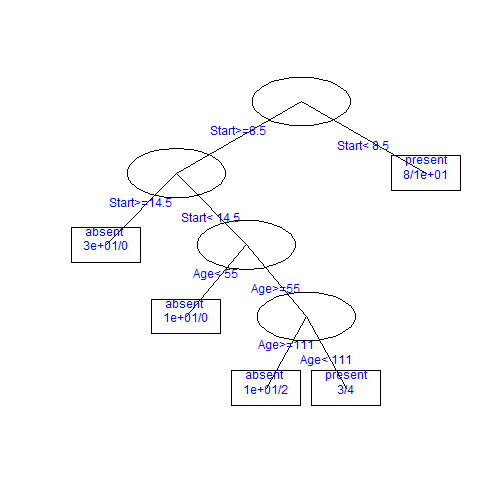

第10周 数据分析与R语言  -- 张丹(24)
========================================================

书面作业 
1 薛毅书（纸介质）P421 8.3 (2) 

互动作业 
本周的互动仍以算法和R语言实现为主。 
要求每位同学至少发2篇主题，就算法理论以及在R上的有关用法进行探讨。发到R中国用户组或数据分析与数据挖掘版。 
另外要求每位同学至少参与5个上述主题的讨论（回帖）。

-----------------------------------------------
8.3(2)
------------------------------------------


```r
X <- data.frame(DXBZ = c(9.3, 4.67, 0.96, 1.38, 1.48, 2.6, 2.15, 
    2.14, 6.53, 1.47, 1.17, 0.88, 1.23, 0.99, 0.98, 0.85, 1.57, 1.14, 1.34, 
    0.79, 1.24, 0.96, 0.78, 0.81, 0.57, 1.67, 1.1, 1.49, 1.61, 1.85), CZBZ = c(30.55, 
    29.38, 24.69, 29.24, 25.47, 32.32, 26.31, 28.46, 31.59, 26.43, 23.74, 19.97, 
    16.87, 18.84, 25.18, 26.55, 23.16, 22.57, 23.04, 19.14, 22.53, 21.65, 14.65, 
    13.85, 3.85, 24.36, 16.85, 17.76, 20.27, 20.66), WMBZ = c(8.7, 8.92, 15.21, 
    11.3, 15.39, 8.81, 10.49, 10.87, 11.04, 17.23, 17.46, 24.43, 15.63, 16.22, 
    16.87, 16.15, 15.79, 12.1, 10.45, 10.61, 13.97, 16.24, 24.27, 25.44, 44.43, 
    17.62, 27.93, 27.7, 22.06, 12.75), row.names = c("北京", "天津", "河北", 
    "山西", "内蒙古", "辽宁", "吉林", "黑龙江", "上海", "江苏", 
    "浙江", "安徽", "福建", "江西", "山东", "河南", "湖北", "湖南", 
    "广东", "广西", "海南", "四川", "贵州", "云南", "西藏", "陕西", 
    "甘肃", "青海", "宁夏", "新疆"))
d <- dist(scale(X), method = "euclidean")

library(scatterplot3d)
k <- kmeans(d, 4, nstart = 20)
scatterplot3d(X, color = k$cluster)
```

 

```r

print(k$cluster[which(k$cluster == 1)])
```

```
## 安徽 福建 贵州 云南 甘肃 青海 宁夏 
##    1    1    1    1    1    1    1 
```

```r
print(k$cluster[which(k$cluster == 2)])
```

```
##   河北   山西 内蒙古   辽宁   吉林 黑龙江   江苏   浙江   江西   山东 
##      2      2      2      2      2      2      2      2      2      2 
##   河南   湖北   湖南   广东   广西   海南   四川   陕西   新疆 
##      2      2      2      2      2      2      2      2      2 
```

```r
print(k$cluster[which(k$cluster == 3)])
```

```
## 北京 天津 上海 
##    3    3    3 
```

```r
print(k$cluster[which(k$cluster == 4)])
```

```
## 西藏 
##    4 
```


------------------------------------------
关于dbscan算法的使用
------------------------------------------
R语言dbscan算法在fpc包中.install.packages("fpc")
使用说明:dbscan()
dbscan(data, eps, MinPts = 5, scale = FALSE, method = c("hybrid", "raw","dist"), seeds = TRUE, showplot = FALSE, countmode = NULL)

参数:
data: 矩阵，数据框，相异度矩阵，距离对象
eps:  半径长度
MinPts: 最少密度点

举例：


```r
library(fpc)
```

```
## Loading required package: MASS
```

```
## Loading required package: cluster
```

```
## Loading required package: mclust
```

```
## Package 'mclust' version 3.5
```

```
## Loading required package: flexmix
```

```
## Loading required package: lattice
```

```
## Loading required package: modeltools
```

```
## Loading required package: stats4
```

```
## Loading required package: multcomp
```

```
## Loading required package: mvtnorm
```

```
## Loading required package: survival
```

```
## Loading required package: splines
```

```r
set.seed(665544)
n <- 600
x <- cbind(runif(10, 0, 10) + rnorm(n, sd = 0.2), runif(10, 0, 10) + 
    rnorm(n, sd = 0.2))
ds <- dbscan(x, 0.2)
ds
```

```
## dbscan Pts=600 MinPts=5 eps=0.2
##         0  1  2  3  4  5  6  7  8  9 10 11
## seed    0 50 53 51 52 51 54 54 54 53 51  1
## border 28  4  4  8  5  3  3  4  3  4  6  4
## total  28 54 57 59 57 54 57 58 57 57 57  5
```

```r
plot(ds, x)
```

 


