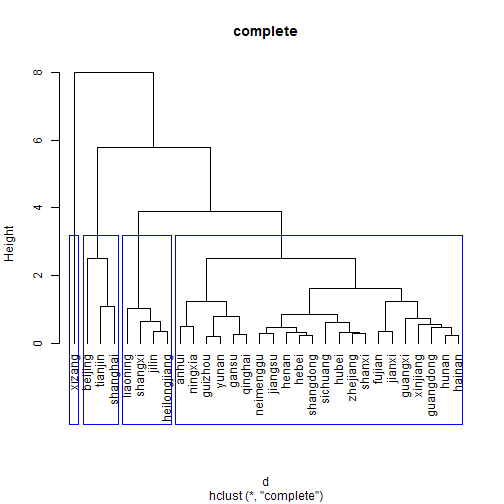
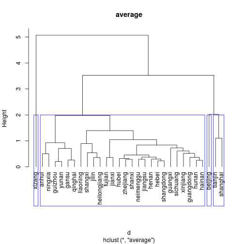
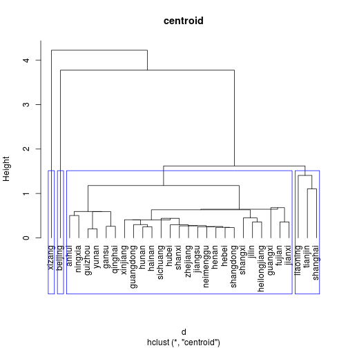
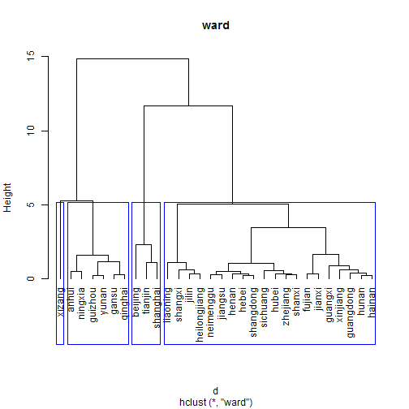
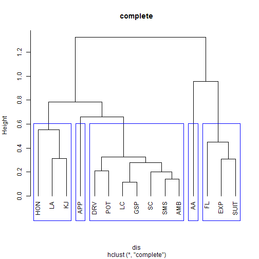
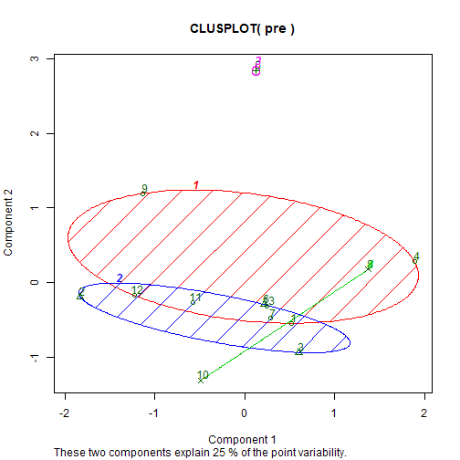
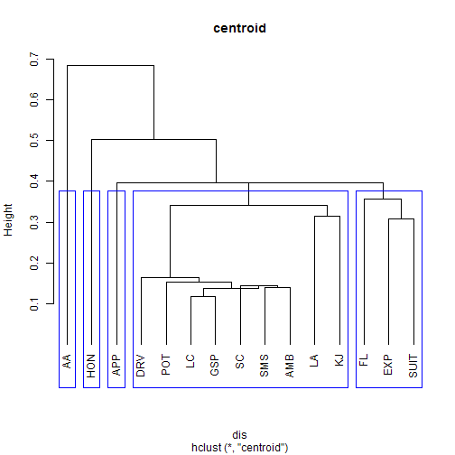
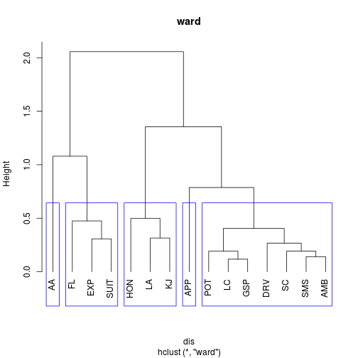

第9周 数据分析与R语言  -- 张丹(24)
========================================================
阅读作业 
阅读薛毅书关于类与类之间距离的部分，理解各种距离的计算公式以及递推公式，以及关于变量聚类的部分（PPT里有，但视频没讲） 

书面作业 
1-2 薛毅书（纸介质）P421 8.3 (1), 8.4 

互动作业 
本周的互动仍以算法和R语言实现为主。 
要求每位同学至少发2篇主题，就算法理论以及在R上的有关用法进行探讨。发到R中国用户组或数据分析与数据挖掘版。 
另外要求每位同学至少参与5个上述主题的讨论（回帖）。

--------------------------------------
#8.3


```r
X<-data.frame(
DXBZ=c(9.30,4.67,0.96,1.38,1.48,2.60,2.15,2.14,6.53,1.47,1.17,0.88,1.23,0.99,0.98,0.85,1.57,1.14,1.34,0.79,1.24,0.96,0.78,0.81,0.57,1.67,1.10,1.49,1.61,1.85),
CZBZ=c(30.55,29.38,24.69,29.24,25.47,32.32,26.31,28.46,31.59,26.43,23.74,19.97,16.87,18.84,25.18,26.55,23.16,22.57,23.04,19.14,22.53,21.65,14.65,13.85,3.85,24.36,16.85,17.76,20.27,20.66),
WMBZ=c(8.70,8.92,15.21,11.30,15.39,8.81,10.49,10.87,11.04,17.23,17.46,24.43,15.63,16.22,16.87,16.15,15.79,12.10,10.45,10.61,13.97,16.24,24.27,25.44,44.43,17.62,27.93,27.70,22.06,12.75),
# row.names = c("北京","天津","河北", "山西", "内蒙古", "辽宁", "吉林",
#                "黑龙江", "上海", "江苏", "浙江", "安徽", "福建", "江西",    
#                "山东",  "河南", "湖北", "湖南", "广东", "广西", "海南",
#                "四川", "贵州", "云南", "西藏", "陕西", "甘肃",
#                "青海", "宁夏", "新疆")
row.names = c("beijing","tianjin","hebei", "shangxi", "neimenggu", "liaoning", "jilin",
               "heilongjiang", "shanghai", "jiangsu", "zhejiang", "anhui", "fujian", "jianxi",    
               "shangdong",  "henan", "hubei", "hunan", "guangdong", "guangxi", "hainan",
               "sichuang", "guizhou", "yunan", "xizang", "shanxi", "gansu",
               "qinghai", "ningxia", "xinjiang")
)

d<-dist(scale(X),method="euclidean")

com<-hclust(d,"complete")
ave<-hclust(d,"average")
cen<-hclust(d,"centroid")
ward<-hclust(d,"ward")

plclust(com,hang=-1,main="complete")
com.rect<-rect.hclust(com,k=4,border=4)
```

 

```r
print(com.rect)
```

```
## [[1]]
## xizang 
##     25 
## 
## [[2]]
##  beijing  tianjin shanghai 
##        1        2        9 
## 
## [[3]]
##      shangxi     liaoning        jilin heilongjiang 
##            4            6            7            8 
## 
## [[4]]
##     hebei neimenggu   jiangsu  zhejiang     anhui    fujian    jianxi 
##         3         5        10        11        12        13        14 
## shangdong     henan     hubei     hunan guangdong   guangxi    hainan 
##        15        16        17        18        19        20        21 
##  sichuang   guizhou     yunan    shanxi     gansu   qinghai   ningxia 
##        22        23        24        26        27        28        29 
##  xinjiang 
##        30 
## 
```

```r

plclust(ave,hang=-1,main="average")
ave.rect<-rect.hclust(ave,k=4,border=4)
```

 

```r
print(ave.rect)
```

```
## [[1]]
## xizang 
##     25 
## 
## [[2]]
##        hebei      shangxi    neimenggu     liaoning        jilin 
##            3            4            5            6            7 
## heilongjiang      jiangsu     zhejiang        anhui       fujian 
##            8           10           11           12           13 
##       jianxi    shangdong        henan        hubei        hunan 
##           14           15           16           17           18 
##    guangdong      guangxi       hainan     sichuang      guizhou 
##           19           20           21           22           23 
##        yunan       shanxi        gansu      qinghai      ningxia 
##           24           26           27           28           29 
##     xinjiang 
##           30 
## 
## [[3]]
## beijing 
##       1 
## 
## [[4]]
##  tianjin shanghai 
##        2        9 
## 
```

```r

plclust(cen,hang=-1,main="centroid")
cen.rect<-rect.hclust(cen,k=4,border=4)
```

 

```r
print(cen.rect)
```

```
## [[1]]
## xizang 
##     25 
## 
## [[2]]
## beijing 
##       1 
## 
## [[3]]
##        hebei      shangxi    neimenggu        jilin heilongjiang 
##            3            4            5            7            8 
##      jiangsu     zhejiang        anhui       fujian       jianxi 
##           10           11           12           13           14 
##    shangdong        henan        hubei        hunan    guangdong 
##           15           16           17           18           19 
##      guangxi       hainan     sichuang      guizhou        yunan 
##           20           21           22           23           24 
##       shanxi        gansu      qinghai      ningxia     xinjiang 
##           26           27           28           29           30 
## 
## [[4]]
##  tianjin liaoning shanghai 
##        2        6        9 
## 
```

```r

plclust(ward,hang=-1,main="ward")
ward.rect<-rect.hclust(ward,k=4,border=4)
```

 

```r
print(ward.rect)
```

```
## [[1]]
## xizang 
##     25 
## 
## [[2]]
##   anhui guizhou   yunan   gansu qinghai ningxia 
##      12      23      24      27      28      29 
## 
## [[3]]
##  beijing  tianjin shanghai 
##        1        2        9 
## 
## [[4]]
##        hebei      shangxi    neimenggu     liaoning        jilin 
##            3            4            5            6            7 
## heilongjiang      jiangsu     zhejiang       fujian       jianxi 
##            8           10           11           13           14 
##    shangdong        henan        hubei        hunan    guangdong 
##           15           16           17           18           19 
##      guangxi       hainan     sichuang       shanxi     xinjiang 
##           20           21           22           26           30 
## 
```


```r
k <- kmeans(d, 4, nstart = 20)
print(k$cluster[which(k$cluster == 1)])
```

```
##        hebei      shangxi    neimenggu     liaoning        jilin 
##            1            1            1            1            1 
## heilongjiang      jiangsu     zhejiang       jianxi    shangdong 
##            1            1            1            1            1 
##        henan        hubei        hunan    guangdong      guangxi 
##            1            1            1            1            1 
##       hainan     sichuang       shanxi     xinjiang 
##            1            1            1            1 
```

```r
print(k$cluster[which(k$cluster == 2)])
```

```
## xizang 
##      2 
```

```r
print(k$cluster[which(k$cluster == 3)])
```

```
##  beijing  tianjin shanghai 
##        3        3        3 
```

```r
print(k$cluster[which(k$cluster == 4)])
```

```
##   anhui  fujian guizhou   yunan   gansu qinghai ningxia 
##       4       4       4       4       4       4       4 
```


--------------------------------------
#8.4


```r
data <- read.table(file = "applicant.data")
d <- 1 - cor(data)
dis <- as.dist(d)

com <- hclust(dis, "complete")
ave <- hclust(dis, "average")
cen <- hclust(dis, "centroid")
ward <- hclust(dis, "ward")

plclust(com, hang = -1, main = "complete")
com.rect <- rect.hclust(com, k = 5, border = 4)
```

 

```r
print(com.rect)
```

```
## [[1]]
##  LA HON  KJ 
##   4   7  14 
## 
## [[2]]
## APP 
##   2 
## 
## [[3]]
##  SC  LC SMS DRV AMB GSP POT 
##   5   6   8  10  11  12  13 
## 
## [[4]]
## AA 
##  3 
## 
## [[5]]
##   FL  EXP SUIT 
##    1    9   15 
## 
```

```r

plclust(ave, hang = -1, main = "average")
ave.rect <- rect.hclust(ave, k = 5, border = 4)
```

 

```r
print(ave.rect)
```

```
## [[1]]
## AA 
##  3 
## 
## [[2]]
##   FL  EXP SUIT 
##    1    9   15 
## 
## [[3]]
##  LA HON  KJ 
##   4   7  14 
## 
## [[4]]
## APP 
##   2 
## 
## [[5]]
##  SC  LC SMS DRV AMB GSP POT 
##   5   6   8  10  11  12  13 
## 
```

```r

plclust(cen, hang = -1, main = "centroid")
cen.rect <- rect.hclust(cen, k = 5, border = 4)
```

 

```r
print(cen.rect)
```

```
## [[1]]
## AA 
##  3 
## 
## [[2]]
## HON 
##   7 
## 
## [[3]]
## APP 
##   2 
## 
## [[4]]
##  LA  SC  LC SMS DRV AMB GSP POT  KJ 
##   4   5   6   8  10  11  12  13  14 
## 
## [[5]]
##   FL  EXP SUIT 
##    1    9   15 
## 
```

```r

plclust(ward, hang = -1, main = "ward")
ward.rect <- rect.hclust(ward, k = 5, border = 4)
```

 

```r
print(ward.rect)
```

```
## [[1]]
## AA 
##  3 
## 
## [[2]]
##   FL  EXP SUIT 
##    1    9   15 
## 
## [[3]]
##  LA HON  KJ 
##   4   7  14 
## 
## [[4]]
## APP 
##   2 
## 
## [[5]]
##  SC  LC SMS DRV AMB GSP POT 
##   5   6   8  10  11  12  13 
## 
```


