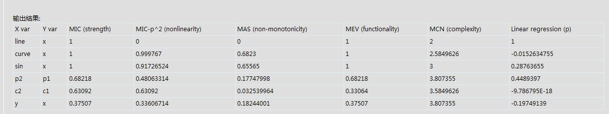

分析大型数据集内的趋势--对6种内集的测试
========================================================

参考Science的一篇文章
Detecting Novel Associations in Large Data Sets

## 构造数据集，如下图显示

```{r}
par(mfrow=c(3,2))
x<-runif(100,max=100,min=50)
y<-rnorm(100,mean=100,sd=10)
plot(x,y)

line<-0.8*x+21
plot(x,line)

curve<-0.534*x^2-80*x+100
plot(x,curve)

sin<-sin(x/5)
plot(x,sin)

p1=jitter(c(rep(4,10),rep(5,40),rep(8,30),rep(15,20)),factor=4)
p2=jitter(c(rep(2,40),rep(10,20),rep(3,30),rep(15,10)),factor=4)
plot(p1,p2)

z=seq(0,2*pi,length=100)
c1=sin(z)
c2=cos(z)
plot(c1,c2)

```

### 输出数据到文件
```{r}
data<-data.frame(x=x,y=y,line=line,curve=curve,sin=sin,p1=p1,p2=p2,c1=c1,c2=c2)
write.table(data,file="relation.csv",col.names=TRUE,row.names=FALSE,quote=FALSE,sep=",")
```

### 产生分析结果

```{r}
source("MINE.r")
MINE("relation.csv",'all.pairs',0)

```

### 对结果数据进行抓图



#### x,y为线性情况：MIC=1，是强关联
#### x,y为曲线情况：MIC=1，是强关联
#### x,y为正弦情况：MIC=1，是强关联
#### x,y为噪点情况：MIC=0.68，是强关联
#### x,y为圆形情况：MIC=0.63，是强关联
#### x,y为随机情况：MIC=0.37，无关联


