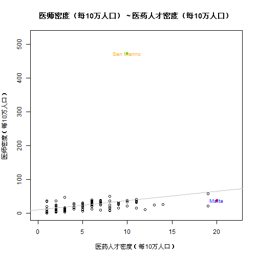
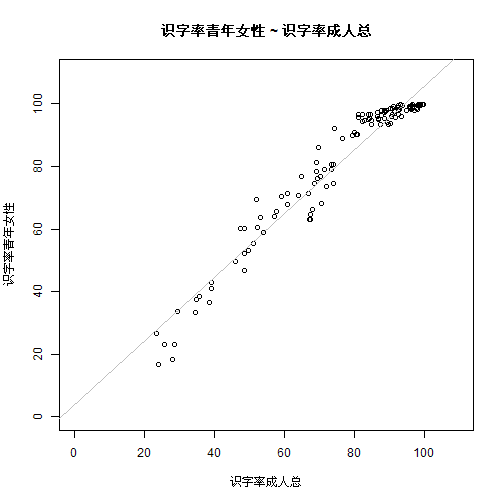
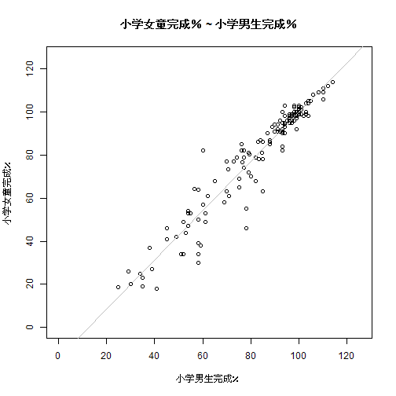
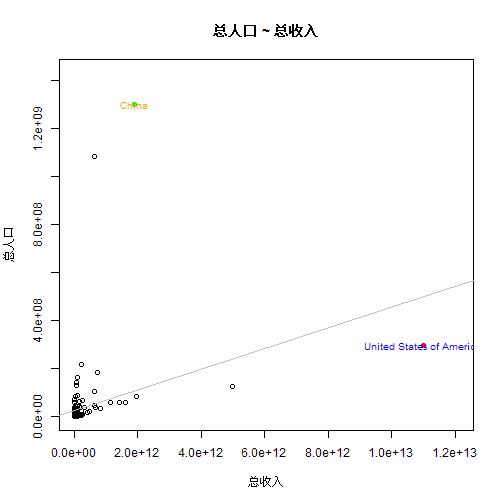
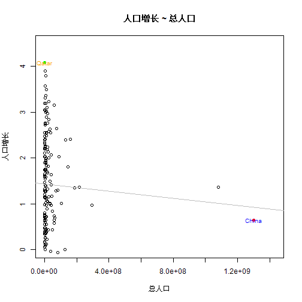

使用MINE工具包进行，分析大型数据集内的趋势
========================================================

参考Science的一篇文章
Detecting Novel Associations in Large Data Sets

### Who_zh.csv,请使用本文工具打开,excel是乱码


```r
source("MINE.r")
```

```
## Error: 1:1: 意外的输入 1: << ^
```

```r
data <- read.csv("WHO.csv")
label <- read.csv("Who_zh.csv", header = FALSE)
names(label) <- c("英文", "中
who <- function(x, y, mp = TRUE) {
    print(paste(label[x, ]$英文, label[x, ]$中文))
    print(paste(label[y, ]$英文, label[y, ]$中文))
    title <- paste(label[y, ]$中文, "~", label[x, ]$中文)
    
    data.lm <- lm(data[[y]] ~ data[[x]])
    print(summary(data.lm))
    plot(data[[y]] ~ data[[x]], main = title, xlab = label[x, ]$中文, ylab = label[y, 
        ]$中文, xlim = c(0, max(data[[x]], na.rm = TRUE) * 1.1), ylim = c(0, 
        max(data[[y]], na.rm = TRUE) * 1.1))
    abline(data.lm, col = "gray")
    
    max_x <- which(data[[x]] == max(data[[x]], na.rm = TRUE))
    max_y <- which(data[[y]] == max(data[[y]], na.rm = TRUE))
    
    if (mp) {
        # max_x
        name <- data[max_x, ]$Country
        tx <- data[max_x, ][x]
        ty <- data[max_x, ][y]
        points(tx, ty, col = "red", pch = 19)
        text(tx, ty, name, col = "blue", cex = 0.8)
        
        # max_y
        name <- data[max_y, ]$Country
        tx <- data[max_y, ][x]
        ty <- data[max_y, ][y]
        points(tx, ty, col = "green", pch = 19)
        text(tx, ty, name, col = "orange", cex = 0.8)
    }
}


who(61, 62)  #医师密度（每10万人口）~医药人才密度（每10万人口）
```

```
## [1] "Pharmaceutical personnel density (per 10 000 population) 医药人才密度（每10万人口）"
## [1] "Physicians density (per 10 000 population) 医师密度（每10万人口）"
## 
## Call:
## lm(formula = data[[y]] ~ data[[x]])
## 
## Residuals:
##    Min     1Q Median     3Q    Max 
##  -41.0  -10.7   -4.4    4.0  436.5 
## 
## Coefficients:
##             Estimate Std. Error t value Pr(>|t|)  
## (Intercept)    10.23       7.68    1.33    0.186  
## data[[x]]       2.73       1.09    2.50    0.014 *
## ---
## Signif. codes:  0 '***' 0.001 '**' 0.01 '*' 0.05 '.' 0.1 ' ' 1 
## 
## Residual standard error: 45.2 on 101 degrees of freedom
##   (99 observations deleted due to missingness)
## Multiple R-squared: 0.0582,	Adjusted R-squared: 0.0489 
## F-statistic: 6.24 on 1 and 101 DF,  p-value: 0.0141 
## 
```

```
## Warning: 'mbcsToSbcs'里转换'鍖诲笀瀵嗗害锛堟瘡10涓囦汉鍙ｏ級 ~
## 鍖昏嵂浜烘墠瀵嗗害锛堟瘡10涓囦汉鍙ｏ級'出错：<e5>代替了dot
```

```
## Warning: 'mbcsToSbcs'里转换'鍖诲笀瀵嗗害锛堟瘡10涓囦汉鍙ｏ級 ~
## 鍖昏嵂浜烘墠瀵嗗害锛堟瘡10涓囦汉鍙ｏ級'出错：<8c>代替了dot
```

```
## Warning: 'mbcsToSbcs'里转换'鍖诲笀瀵嗗害锛堟瘡10涓囦汉鍙ｏ級 ~
## 鍖昏嵂浜烘墠瀵嗗害锛堟瘡10涓囦汉鍙ｏ級'出错：<bb>代替了dot
```

```
## Warning: 'mbcsToSbcs'里转换'鍖诲笀瀵嗗害锛堟瘡10涓囦汉鍙ｏ級 ~
## 鍖昏嵂浜烘墠瀵嗗害锛堟瘡10涓囦汉鍙ｏ級'出错：<e5>代替了dot
```

```
## Warning: 'mbcsToSbcs'里转换'鍖诲笀瀵嗗害锛堟瘡10涓囦汉鍙ｏ級 ~
## 鍖昏嵂浜烘墠瀵嗗害锛堟瘡10涓囦汉鍙ｏ級'出错：<b8>代替了dot
```

```
## Warning: 'mbcsToSbcs'里转换'鍖诲笀瀵嗗害锛堟瘡10涓囦汉鍙ｏ級 ~
## 鍖昏嵂浜烘墠瀵嗗害锛堟瘡10涓囦汉鍙ｏ級'出错：<88>代替了dot
```

```
## Warning: 'mbcsToSbcs'里转换'鍖诲笀瀵嗗害锛堟瘡10涓囦汉鍙ｏ級 ~
## 鍖昏嵂浜烘墠瀵嗗害锛堟瘡10涓囦汉鍙ｏ級'出错：<e5>代替了dot
```

```
## Warning: 'mbcsToSbcs'里转换'鍖诲笀瀵嗗害锛堟瘡10涓囦汉鍙ｏ級 ~
## 鍖昏嵂浜烘墠瀵嗗害锛堟瘡10涓囦汉鍙ｏ級'出错：<af>代替了dot
```

```
## Warning: 'mbcsToSbcs'里转换'鍖诲笀瀵嗗害锛堟瘡10涓囦汉鍙ｏ級 ~
## 鍖昏嵂浜烘墠瀵嗗害锛堟瘡10涓囦汉鍙ｏ級'出错：<86>代替了dot
```

```
## Warning: 'mbcsToSbcs'里转换'鍖诲笀瀵嗗害锛堟瘡10涓囦汉鍙ｏ級 ~
## 鍖昏嵂浜烘墠瀵嗗害锛堟瘡10涓囦汉鍙ｏ級'出错：<e5>代替了dot
```

```
## Warning: 'mbcsToSbcs'里转换'鍖诲笀瀵嗗害锛堟瘡10涓囦汉鍙ｏ級 ~
## 鍖昏嵂浜烘墠瀵嗗害锛堟瘡10涓囦汉鍙ｏ級'出错：<ba>代替了dot
```

```
## Warning: 'mbcsToSbcs'里转换'鍖诲笀瀵嗗害锛堟瘡10涓囦汉鍙ｏ級 ~
## 鍖昏嵂浜烘墠瀵嗗害锛堟瘡10涓囦汉鍙ｏ級'出错：<a6>代替了dot
```

```
## Warning: 'mbcsToSbcs'里转换'鍖诲笀瀵嗗害锛堟瘡10涓囦汉鍙ｏ級 ~
## 鍖昏嵂浜烘墠瀵嗗害锛堟瘡10涓囦汉鍙ｏ級'出错：<e6>代替了dot
```

```
## Warning: 'mbcsToSbcs'里转换'鍖诲笀瀵嗗害锛堟瘡10涓囦汉鍙ｏ級 ~
## 鍖昏嵂浜烘墠瀵嗗害锛堟瘡10涓囦汉鍙ｏ級'出错：<af>代替了dot
```

```
## Warning: 'mbcsToSbcs'里转换'鍖诲笀瀵嗗害锛堟瘡10涓囦汉鍙ｏ級 ~
## 鍖昏嵂浜烘墠瀵嗗害锛堟瘡10涓囦汉鍙ｏ級'出错：<8f>代替了dot
```

```
## Warning: 'mbcsToSbcs'里转换'鍖诲笀瀵嗗害锛堟瘡10涓囦汉鍙ｏ級 ~
## 鍖昏嵂浜烘墠瀵嗗害锛堟瘡10涓囦汉鍙ｏ級'出错：<e4>代替了dot
```

```
## Warning: 'mbcsToSbcs'里转换'鍖诲笀瀵嗗害锛堟瘡10涓囦汉鍙ｏ級 ~
## 鍖昏嵂浜烘墠瀵嗗害锛堟瘡10涓囦汉鍙ｏ級'出错：<b8>代替了dot
```

```
## Warning: 'mbcsToSbcs'里转换'鍖诲笀瀵嗗害锛堟瘡10涓囦汉鍙ｏ級 ~
## 鍖昏嵂浜烘墠瀵嗗害锛堟瘡10涓囦汉鍙ｏ級'出错：<87>代替了dot
```

```
## Warning: 'mbcsToSbcs'里转换'鍖诲笀瀵嗗害锛堟瘡10涓囦汉鍙ｏ級 ~
## 鍖昏嵂浜烘墠瀵嗗害锛堟瘡10涓囦汉鍙ｏ級'出错：<e4>代替了dot
```

```
## Warning: 'mbcsToSbcs'里转换'鍖诲笀瀵嗗害锛堟瘡10涓囦汉鍙ｏ級 ~
## 鍖昏嵂浜烘墠瀵嗗害锛堟瘡10涓囦汉鍙ｏ級'出错：<ba>代替了dot
```

```
## Warning: 'mbcsToSbcs'里转换'鍖诲笀瀵嗗害锛堟瘡10涓囦汉鍙ｏ級 ~
## 鍖昏嵂浜烘墠瀵嗗害锛堟瘡10涓囦汉鍙ｏ級'出错：<ba>代替了dot
```

```
## Warning: 'mbcsToSbcs'里转换'鍖诲笀瀵嗗害锛堟瘡10涓囦汉鍙ｏ級 ~
## 鍖昏嵂浜烘墠瀵嗗害锛堟瘡10涓囦汉鍙ｏ級'出错：<e5>代替了dot
```

```
## Warning: 'mbcsToSbcs'里转换'鍖诲笀瀵嗗害锛堟瘡10涓囦汉鍙ｏ級 ~
## 鍖昏嵂浜烘墠瀵嗗害锛堟瘡10涓囦汉鍙ｏ級'出错：<8f>代替了dot
```

```
## Warning: 'mbcsToSbcs'里转换'鍖诲笀瀵嗗害锛堟瘡10涓囦汉鍙ｏ級 ~
## 鍖昏嵂浜烘墠瀵嗗害锛堟瘡10涓囦汉鍙ｏ級'出错：<a3>代替了dot
```

```
## Warning: 'mbcsToSbcs'里转换'鍖诲笀瀵嗗害锛堟瘡10涓囦汉鍙ｏ級 ~
## 鍖昏嵂浜烘墠瀵嗗害锛堟瘡10涓囦汉鍙ｏ級'出错：<e5>代替了dot
```

```
## Warning: 'mbcsToSbcs'里转换'鍖诲笀瀵嗗害锛堟瘡10涓囦汉鍙ｏ級 ~
## 鍖昏嵂浜烘墠瀵嗗害锛堟瘡10涓囦汉鍙ｏ級'出错：<8c>代替了dot
```

```
## Warning: 'mbcsToSbcs'里转换'鍖诲笀瀵嗗害锛堟瘡10涓囦汉鍙ｏ級 ~
## 鍖昏嵂浜烘墠瀵嗗害锛堟瘡10涓囦汉鍙ｏ級'出错：<bb>代替了dot
```

```
## Warning: 'mbcsToSbcs'里转换'鍖诲笀瀵嗗害锛堟瘡10涓囦汉鍙ｏ級 ~
## 鍖昏嵂浜烘墠瀵嗗害锛堟瘡10涓囦汉鍙ｏ級'出错：<e8>代替了dot
```

```
## Warning: 'mbcsToSbcs'里转换'鍖诲笀瀵嗗害锛堟瘡10涓囦汉鍙ｏ級 ~
## 鍖昏嵂浜烘墠瀵嗗害锛堟瘡10涓囦汉鍙ｏ級'出错：<8d>代替了dot
```

```
## Warning: 'mbcsToSbcs'里转换'鍖诲笀瀵嗗害锛堟瘡10涓囦汉鍙ｏ級 ~
## 鍖昏嵂浜烘墠瀵嗗害锛堟瘡10涓囦汉鍙ｏ級'出错：<af>代替了dot
```

```
## Warning: 'mbcsToSbcs'里转换'鍖诲笀瀵嗗害锛堟瘡10涓囦汉鍙ｏ級 ~
## 鍖昏嵂浜烘墠瀵嗗害锛堟瘡10涓囦汉鍙ｏ級'出错：<e4>代替了dot
```

```
## Warning: 'mbcsToSbcs'里转换'鍖诲笀瀵嗗害锛堟瘡10涓囦汉鍙ｏ級 ~
## 鍖昏嵂浜烘墠瀵嗗害锛堟瘡10涓囦汉鍙ｏ級'出错：<ba>代替了dot
```

```
## Warning: 'mbcsToSbcs'里转换'鍖诲笀瀵嗗害锛堟瘡10涓囦汉鍙ｏ級 ~
## 鍖昏嵂浜烘墠瀵嗗害锛堟瘡10涓囦汉鍙ｏ級'出错：<ba>代替了dot
```

```
## Warning: 'mbcsToSbcs'里转换'鍖诲笀瀵嗗害锛堟瘡10涓囦汉鍙ｏ級 ~
## 鍖昏嵂浜烘墠瀵嗗害锛堟瘡10涓囦汉鍙ｏ級'出错：<e6>代替了dot
```

```
## Warning: 'mbcsToSbcs'里转换'鍖诲笀瀵嗗害锛堟瘡10涓囦汉鍙ｏ級 ~
## 鍖昏嵂浜烘墠瀵嗗害锛堟瘡10涓囦汉鍙ｏ級'出错：<89>代替了dot
```

```
## Warning: 'mbcsToSbcs'里转换'鍖诲笀瀵嗗害锛堟瘡10涓囦汉鍙ｏ級 ~
## 鍖昏嵂浜烘墠瀵嗗害锛堟瘡10涓囦汉鍙ｏ級'出错：<8d>代替了dot
```

```
## Warning: 'mbcsToSbcs'里转换'鍖诲笀瀵嗗害锛堟瘡10涓囦汉鍙ｏ級 ~
## 鍖昏嵂浜烘墠瀵嗗害锛堟瘡10涓囦汉鍙ｏ級'出错：<e5>代替了dot
```

```
## Warning: 'mbcsToSbcs'里转换'鍖诲笀瀵嗗害锛堟瘡10涓囦汉鍙ｏ級 ~
## 鍖昏嵂浜烘墠瀵嗗害锛堟瘡10涓囦汉鍙ｏ級'出错：<af>代替了dot
```

```
## Warning: 'mbcsToSbcs'里转换'鍖诲笀瀵嗗害锛堟瘡10涓囦汉鍙ｏ級 ~
## 鍖昏嵂浜烘墠瀵嗗害锛堟瘡10涓囦汉鍙ｏ級'出错：<86>代替了dot
```

```
## Warning: 'mbcsToSbcs'里转换'鍖诲笀瀵嗗害锛堟瘡10涓囦汉鍙ｏ級 ~
## 鍖昏嵂浜烘墠瀵嗗害锛堟瘡10涓囦汉鍙ｏ級'出错：<e5>代替了dot
```

```
## Warning: 'mbcsToSbcs'里转换'鍖诲笀瀵嗗害锛堟瘡10涓囦汉鍙ｏ級 ~
## 鍖昏嵂浜烘墠瀵嗗害锛堟瘡10涓囦汉鍙ｏ級'出错：<ba>代替了dot
```

```
## Warning: 'mbcsToSbcs'里转换'鍖诲笀瀵嗗害锛堟瘡10涓囦汉鍙ｏ級 ~
## 鍖昏嵂浜烘墠瀵嗗害锛堟瘡10涓囦汉鍙ｏ級'出错：<a6>代替了dot
```

```
## Warning: 'mbcsToSbcs'里转换'鍖诲笀瀵嗗害锛堟瘡10涓囦汉鍙ｏ級 ~
## 鍖昏嵂浜烘墠瀵嗗害锛堟瘡10涓囦汉鍙ｏ級'出错：<e6>代替了dot
```

```
## Warning: 'mbcsToSbcs'里转换'鍖诲笀瀵嗗害锛堟瘡10涓囦汉鍙ｏ級 ~
## 鍖昏嵂浜烘墠瀵嗗害锛堟瘡10涓囦汉鍙ｏ級'出错：<af>代替了dot
```

```
## Warning: 'mbcsToSbcs'里转换'鍖诲笀瀵嗗害锛堟瘡10涓囦汉鍙ｏ級 ~
## 鍖昏嵂浜烘墠瀵嗗害锛堟瘡10涓囦汉鍙ｏ級'出错：<8f>代替了dot
```

```
## Warning: 'mbcsToSbcs'里转换'鍖诲笀瀵嗗害锛堟瘡10涓囦汉鍙ｏ級 ~
## 鍖昏嵂浜烘墠瀵嗗害锛堟瘡10涓囦汉鍙ｏ級'出错：<e4>代替了dot
```

```
## Warning: 'mbcsToSbcs'里转换'鍖诲笀瀵嗗害锛堟瘡10涓囦汉鍙ｏ級 ~
## 鍖昏嵂浜烘墠瀵嗗害锛堟瘡10涓囦汉鍙ｏ級'出错：<b8>代替了dot
```

```
## Warning: 'mbcsToSbcs'里转换'鍖诲笀瀵嗗害锛堟瘡10涓囦汉鍙ｏ級 ~
## 鍖昏嵂浜烘墠瀵嗗害锛堟瘡10涓囦汉鍙ｏ級'出错：<87>代替了dot
```

```
## Warning: 'mbcsToSbcs'里转换'鍖诲笀瀵嗗害锛堟瘡10涓囦汉鍙ｏ級 ~
## 鍖昏嵂浜烘墠瀵嗗害锛堟瘡10涓囦汉鍙ｏ級'出错：<e4>代替了dot
```

```
## Warning: 'mbcsToSbcs'里转换'鍖诲笀瀵嗗害锛堟瘡10涓囦汉鍙ｏ級 ~
## 鍖昏嵂浜烘墠瀵嗗害锛堟瘡10涓囦汉鍙ｏ級'出错：<ba>代替了dot
```

```
## Warning: 'mbcsToSbcs'里转换'鍖诲笀瀵嗗害锛堟瘡10涓囦汉鍙ｏ級 ~
## 鍖昏嵂浜烘墠瀵嗗害锛堟瘡10涓囦汉鍙ｏ級'出错：<ba>代替了dot
```

```
## Warning: 'mbcsToSbcs'里转换'鍖诲笀瀵嗗害锛堟瘡10涓囦汉鍙ｏ級 ~
## 鍖昏嵂浜烘墠瀵嗗害锛堟瘡10涓囦汉鍙ｏ級'出错：<e5>代替了dot
```

```
## Warning: 'mbcsToSbcs'里转换'鍖诲笀瀵嗗害锛堟瘡10涓囦汉鍙ｏ級 ~
## 鍖昏嵂浜烘墠瀵嗗害锛堟瘡10涓囦汉鍙ｏ級'出错：<8f>代替了dot
```

```
## Warning: 'mbcsToSbcs'里转换'鍖诲笀瀵嗗害锛堟瘡10涓囦汉鍙ｏ級 ~
## 鍖昏嵂浜烘墠瀵嗗害锛堟瘡10涓囦汉鍙ｏ級'出错：<a3>代替了dot
```

```
## Warning:
## 'mbcsToSbcs'里转换'鍖昏嵂浜烘墠瀵嗗害锛堟瘡10涓囦汉鍙ｏ級'出错：<e5>代替了dot
```

```
## Warning:
## 'mbcsToSbcs'里转换'鍖昏嵂浜烘墠瀵嗗害锛堟瘡10涓囦汉鍙ｏ級'出错：<8c>代替了dot
```

```
## Warning:
## 'mbcsToSbcs'里转换'鍖昏嵂浜烘墠瀵嗗害锛堟瘡10涓囦汉鍙ｏ級'出错：<bb>代替了dot
```

```
## Warning:
## 'mbcsToSbcs'里转换'鍖昏嵂浜烘墠瀵嗗害锛堟瘡10涓囦汉鍙ｏ級'出错：<e8>代替了dot
```

```
## Warning:
## 'mbcsToSbcs'里转换'鍖昏嵂浜烘墠瀵嗗害锛堟瘡10涓囦汉鍙ｏ級'出错：<8d>代替了dot
```

```
## Warning:
## 'mbcsToSbcs'里转换'鍖昏嵂浜烘墠瀵嗗害锛堟瘡10涓囦汉鍙ｏ級'出错：<af>代替了dot
```

```
## Warning:
## 'mbcsToSbcs'里转换'鍖昏嵂浜烘墠瀵嗗害锛堟瘡10涓囦汉鍙ｏ級'出错：<e4>代替了dot
```

```
## Warning:
## 'mbcsToSbcs'里转换'鍖昏嵂浜烘墠瀵嗗害锛堟瘡10涓囦汉鍙ｏ級'出错：<ba>代替了dot
```

```
## Warning:
## 'mbcsToSbcs'里转换'鍖昏嵂浜烘墠瀵嗗害锛堟瘡10涓囦汉鍙ｏ級'出错：<ba>代替了dot
```

```
## Warning:
## 'mbcsToSbcs'里转换'鍖昏嵂浜烘墠瀵嗗害锛堟瘡10涓囦汉鍙ｏ級'出错：<e6>代替了dot
```

```
## Warning:
## 'mbcsToSbcs'里转换'鍖昏嵂浜烘墠瀵嗗害锛堟瘡10涓囦汉鍙ｏ級'出错：<89>代替了dot
```

```
## Warning:
## 'mbcsToSbcs'里转换'鍖昏嵂浜烘墠瀵嗗害锛堟瘡10涓囦汉鍙ｏ級'出错：<8d>代替了dot
```

```
## Warning:
## 'mbcsToSbcs'里转换'鍖昏嵂浜烘墠瀵嗗害锛堟瘡10涓囦汉鍙ｏ級'出错：<e5>代替了dot
```

```
## Warning:
## 'mbcsToSbcs'里转换'鍖昏嵂浜烘墠瀵嗗害锛堟瘡10涓囦汉鍙ｏ級'出错：<af>代替了dot
```

```
## Warning:
## 'mbcsToSbcs'里转换'鍖昏嵂浜烘墠瀵嗗害锛堟瘡10涓囦汉鍙ｏ級'出错：<86>代替了dot
```

```
## Warning:
## 'mbcsToSbcs'里转换'鍖昏嵂浜烘墠瀵嗗害锛堟瘡10涓囦汉鍙ｏ級'出错：<e5>代替了dot
```

```
## Warning:
## 'mbcsToSbcs'里转换'鍖昏嵂浜烘墠瀵嗗害锛堟瘡10涓囦汉鍙ｏ級'出错：<ba>代替了dot
```

```
## Warning:
## 'mbcsToSbcs'里转换'鍖昏嵂浜烘墠瀵嗗害锛堟瘡10涓囦汉鍙ｏ級'出错：<a6>代替了dot
```

```
## Warning:
## 'mbcsToSbcs'里转换'鍖昏嵂浜烘墠瀵嗗害锛堟瘡10涓囦汉鍙ｏ級'出错：<e6>代替了dot
```

```
## Warning:
## 'mbcsToSbcs'里转换'鍖昏嵂浜烘墠瀵嗗害锛堟瘡10涓囦汉鍙ｏ級'出错：<af>代替了dot
```

```
## Warning:
## 'mbcsToSbcs'里转换'鍖昏嵂浜烘墠瀵嗗害锛堟瘡10涓囦汉鍙ｏ級'出错：<8f>代替了dot
```

```
## Warning:
## 'mbcsToSbcs'里转换'鍖昏嵂浜烘墠瀵嗗害锛堟瘡10涓囦汉鍙ｏ級'出错：<e4>代替了dot
```

```
## Warning:
## 'mbcsToSbcs'里转换'鍖昏嵂浜烘墠瀵嗗害锛堟瘡10涓囦汉鍙ｏ級'出错：<b8>代替了dot
```

```
## Warning:
## 'mbcsToSbcs'里转换'鍖昏嵂浜烘墠瀵嗗害锛堟瘡10涓囦汉鍙ｏ級'出错：<87>代替了dot
```

```
## Warning:
## 'mbcsToSbcs'里转换'鍖昏嵂浜烘墠瀵嗗害锛堟瘡10涓囦汉鍙ｏ級'出错：<e4>代替了dot
```

```
## Warning:
## 'mbcsToSbcs'里转换'鍖昏嵂浜烘墠瀵嗗害锛堟瘡10涓囦汉鍙ｏ級'出错：<ba>代替了dot
```

```
## Warning:
## 'mbcsToSbcs'里转换'鍖昏嵂浜烘墠瀵嗗害锛堟瘡10涓囦汉鍙ｏ級'出错：<ba>代替了dot
```

```
## Warning:
## 'mbcsToSbcs'里转换'鍖昏嵂浜烘墠瀵嗗害锛堟瘡10涓囦汉鍙ｏ級'出错：<e5>代替了dot
```

```
## Warning:
## 'mbcsToSbcs'里转换'鍖昏嵂浜烘墠瀵嗗害锛堟瘡10涓囦汉鍙ｏ級'出错：<8f>代替了dot
```

```
## Warning:
## 'mbcsToSbcs'里转换'鍖昏嵂浜烘墠瀵嗗害锛堟瘡10涓囦汉鍙ｏ級'出错：<a3>代替了dot
```

```
## Warning:
## 'mbcsToSbcs'里转换'鍖诲笀瀵嗗害锛堟瘡10涓囦汉鍙ｏ級'出错：<e5>代替了dot
```

```
## Warning:
## 'mbcsToSbcs'里转换'鍖诲笀瀵嗗害锛堟瘡10涓囦汉鍙ｏ級'出错：<8c>代替了dot
```

```
## Warning:
## 'mbcsToSbcs'里转换'鍖诲笀瀵嗗害锛堟瘡10涓囦汉鍙ｏ級'出错：<bb>代替了dot
```

```
## Warning:
## 'mbcsToSbcs'里转换'鍖诲笀瀵嗗害锛堟瘡10涓囦汉鍙ｏ級'出错：<e5>代替了dot
```

```
## Warning:
## 'mbcsToSbcs'里转换'鍖诲笀瀵嗗害锛堟瘡10涓囦汉鍙ｏ級'出错：<b8>代替了dot
```

```
## Warning:
## 'mbcsToSbcs'里转换'鍖诲笀瀵嗗害锛堟瘡10涓囦汉鍙ｏ級'出错：<88>代替了dot
```

```
## Warning:
## 'mbcsToSbcs'里转换'鍖诲笀瀵嗗害锛堟瘡10涓囦汉鍙ｏ級'出错：<e5>代替了dot
```

```
## Warning:
## 'mbcsToSbcs'里转换'鍖诲笀瀵嗗害锛堟瘡10涓囦汉鍙ｏ級'出错：<af>代替了dot
```

```
## Warning:
## 'mbcsToSbcs'里转换'鍖诲笀瀵嗗害锛堟瘡10涓囦汉鍙ｏ級'出错：<86>代替了dot
```

```
## Warning:
## 'mbcsToSbcs'里转换'鍖诲笀瀵嗗害锛堟瘡10涓囦汉鍙ｏ級'出错：<e5>代替了dot
```

```
## Warning:
## 'mbcsToSbcs'里转换'鍖诲笀瀵嗗害锛堟瘡10涓囦汉鍙ｏ級'出错：<ba>代替了dot
```

```
## Warning:
## 'mbcsToSbcs'里转换'鍖诲笀瀵嗗害锛堟瘡10涓囦汉鍙ｏ級'出错：<a6>代替了dot
```

```
## Warning:
## 'mbcsToSbcs'里转换'鍖诲笀瀵嗗害锛堟瘡10涓囦汉鍙ｏ級'出错：<e6>代替了dot
```

```
## Warning:
## 'mbcsToSbcs'里转换'鍖诲笀瀵嗗害锛堟瘡10涓囦汉鍙ｏ級'出错：<af>代替了dot
```

```
## Warning:
## 'mbcsToSbcs'里转换'鍖诲笀瀵嗗害锛堟瘡10涓囦汉鍙ｏ級'出错：<8f>代替了dot
```

```
## Warning:
## 'mbcsToSbcs'里转换'鍖诲笀瀵嗗害锛堟瘡10涓囦汉鍙ｏ級'出错：<e4>代替了dot
```

```
## Warning:
## 'mbcsToSbcs'里转换'鍖诲笀瀵嗗害锛堟瘡10涓囦汉鍙ｏ級'出错：<b8>代替了dot
```

```
## Warning:
## 'mbcsToSbcs'里转换'鍖诲笀瀵嗗害锛堟瘡10涓囦汉鍙ｏ級'出错：<87>代替了dot
```

```
## Warning:
## 'mbcsToSbcs'里转换'鍖诲笀瀵嗗害锛堟瘡10涓囦汉鍙ｏ級'出错：<e4>代替了dot
```

```
## Warning:
## 'mbcsToSbcs'里转换'鍖诲笀瀵嗗害锛堟瘡10涓囦汉鍙ｏ級'出错：<ba>代替了dot
```

```
## Warning:
## 'mbcsToSbcs'里转换'鍖诲笀瀵嗗害锛堟瘡10涓囦汉鍙ｏ級'出错：<ba>代替了dot
```

```
## Warning:
## 'mbcsToSbcs'里转换'鍖诲笀瀵嗗害锛堟瘡10涓囦汉鍙ｏ級'出错：<e5>代替了dot
```

```
## Warning:
## 'mbcsToSbcs'里转换'鍖诲笀瀵嗗害锛堟瘡10涓囦汉鍙ｏ級'出错：<8f>代替了dot
```

```
## Warning:
## 'mbcsToSbcs'里转换'鍖诲笀瀵嗗害锛堟瘡10涓囦汉鍙ｏ級'出错：<a3>代替了dot
```

 

```r
who(263, 264, FALSE)  #年青女性识字率~成人部识字率
```

```
## [1] "Literacy_rate_adult_total 识字率成人总"
## [1] "Literacy_rate_youth_female 识字率青年女性"
## 
## Call:
## lm(formula = data[[y]] ~ data[[x]])
## 
## Residuals:
##    Min     1Q Median     3Q    Max 
## -13.96  -4.34  -0.14   3.28  12.87 
## 
## Coefficients:
##             Estimate Std. Error t value Pr(>|t|)    
## (Intercept)   3.9137     1.7423    2.25    0.026 *  
## data[[x]]     1.0156     0.0215   47.16   <2e-16 ***
## ---
## Signif. codes:  0 '***' 0.001 '**' 0.01 '*' 0.05 '.' 0.1 ' ' 1 
## 
## Residual standard error: 5.15 on 130 degrees of freedom
##   (70 observations deleted due to missingness)
## Multiple R-squared: 0.945,	Adjusted R-squared: 0.944 
## F-statistic: 2.22e+03 on 1 and 130 DF,  p-value: <2e-16 
## 
```

```
## NA
```

```
## NA
```

```
## NA
```

```
## NA
```

```
## NA
```

```
## NA
```

```
## NA
```

```
## NA
```

```
## NA
```

```
## NA
```

```
## NA
```

```
## NA
```

```
## NA
```

```
## NA
```

```
## NA
```

```
## NA
```

```
## NA
```

```
## NA
```

```
## NA
```

```
## NA
```

```
## NA
```

```
## NA
```

```
## NA
```

```
## NA
```

```
## NA
```

```
## NA
```

```
## NA
```

```
## NA
```

```
## NA
```

```
## NA
```

```
## NA
```

```
## NA
```

```
## NA
```

```
## NA
```

```
## NA
```

```
## NA
```

```
## NA
```

```
## NA
```

```
## NA
```

```
## NA
```

```
## NA
```

```
## NA
```

```
## NA
```

```
## NA
```

```
## NA
```

```
## NA
```

```
## NA
```

```
## NA
```

```
## NA
```

```
## NA
```

```
## NA
```

```
## NA
```

```
## NA
```

```
## NA
```

```
## NA
```

```
## NA
```

```
## NA
```

```
## NA
```

```
## NA
```

```
## NA
```

```
## NA
```

```
## NA
```

```
## NA
```

```
## NA
```

```
## NA
```

```
## NA
```

```
## NA
```

```
## NA
```

```
## NA
```

```
## NA
```

```
## NA
```

```
## NA
```

```
## NA
```

```
## NA
```

```
## NA
```

```
## NA
```

```
## NA
```

```
## NA
```

 

```r
who(326, 327, FALSE)  #小学女童完成~小学男童完成
```

```
## [1] "Primary_school_completion_pct_of_boys 小学男生完成％"
## [1] "Primary_school_completion_pct_of_girls 小学女童完成％"
## 
## Call:
## lm(formula = data[[y]] ~ data[[x]])
## 
## Residuals:
##     Min      1Q  Median      3Q     Max 
## -28.829  -2.067   0.311   3.673  27.704 
## 
## Coefficients:
##             Estimate Std. Error t value Pr(>|t|)    
## (Intercept) -14.1499     2.3684   -5.97  1.7e-08 ***
## data[[x]]     1.1408     0.0278   41.07  < 2e-16 ***
## ---
## Signif. codes:  0 '***' 0.001 '**' 0.01 '*' 0.05 '.' 0.1 ' ' 1 
## 
## Residual standard error: 6.92 on 145 degrees of freedom
##   (55 observations deleted due to missingness)
## Multiple R-squared: 0.921,	Adjusted R-squared: 0.92 
## F-statistic: 1.69e+03 on 1 and 145 DF,  p-value: <2e-16 
## 
```

```
## NA
```

```
## NA
```

```
## NA
```

```
## NA
```

```
## NA
```

```
## NA
```

```
## NA
```

```
## NA
```

```
## NA
```

```
## NA
```

```
## NA
```

```
## NA
```

```
## NA
```

```
## NA
```

```
## NA
```

```
## NA
```

```
## NA
```

```
## NA
```

```
## NA
```

```
## NA
```

```
## NA
```

```
## NA
```

```
## NA
```

```
## NA
```

```
## NA
```

```
## NA
```

```
## NA
```

```
## NA
```

```
## NA
```

```
## NA
```

```
## NA
```

```
## NA
```

```
## NA
```

```
## NA
```

```
## NA
```

```
## NA
```

```
## NA
```

```
## NA
```

```
## NA
```

```
## NA
```

```
## NA
```

```
## NA
```

```
## NA
```

```
## NA
```

```
## NA
```

```
## NA
```

```
## NA
```

```
## NA
```

```
## NA
```

```
## NA
```

```
## NA
```

```
## NA
```

```
## NA
```

```
## NA
```

```
## NA
```

```
## NA
```

```
## NA
```

```
## NA
```

```
## NA
```

```
## NA
```

```
## NA
```

```
## NA
```

```
## NA
```

```
## NA
```

```
## NA
```

```
## NA
```

```
## NA
```

```
## NA
```

```
## NA
```

```
## NA
```

```
## NA
```

```
## NA
```

 

```r
who(350, 320)  #总人口~总收入
```

```
## [1] "Total_income 总收入"
## [1] "Population_total 总人口"
## 
## Call:
## lm(formula = data[[y]] ~ data[[x]])
## 
## Residuals:
##       Min        1Q    Median        3Q       Max 
## -2.03e+08 -2.65e+07 -2.25e+07 -1.33e+07  1.19e+09 
## 
## Coefficients:
##             Estimate Std. Error t value Pr(>|t|)    
## (Intercept) 2.69e+07   1.04e+07    2.59     0.01 *  
## data[[x]]   4.29e-05   1.04e-05    4.14  5.7e-05 ***
## ---
## Signif. codes:  0 '***' 0.001 '**' 0.01 '*' 0.05 '.' 0.1 ' ' 1 
## 
## Residual standard error: 1.3e+08 on 161 degrees of freedom
##   (39 observations deleted due to missingness)
## Multiple R-squared: 0.096,	Adjusted R-squared: 0.0904 
## F-statistic: 17.1 on 1 and 161 DF,  p-value: 5.68e-05 
## 
```

```
## NA
```

```
## NA
```

```
## NA
```

```
## NA
```

```
## NA
```

```
## NA
```

```
## NA
```

```
## NA
```

```
## NA
```

```
## NA
```

```
## NA
```

```
## NA
```

```
## NA
```

```
## NA
```

```
## NA
```

```
## NA
```

```
## NA
```

```
## NA
```

```
## NA
```

```
## NA
```

```
## NA
```

```
## NA
```

```
## NA
```

```
## NA
```

```
## NA
```

```
## NA
```

```
## NA
```

```
## NA
```

```
## NA
```

```
## NA
```

```
## NA
```

```
## NA
```

```
## NA
```

```
## NA
```

```
## NA
```

```
## NA
```

 

```r
who(176, 177)  #武器进口~武器出口
```

```
## [1] "Arms_exports 武器出口"
## [1] "Arms_imports 进口武器"
## 
## Call:
## lm(formula = data[[y]] ~ data[[x]])
## 
## Residuals:
##       Min        1Q    Median        3Q       Max 
## -2.53e+08 -2.41e+08 -1.97e+08  3.03e+07  3.54e+09 
## 
## Coefficients:
##             Estimate Std. Error t value Pr(>|t|)    
## (Intercept) 2.53e+08   6.35e+07    3.98  0.00015 ***
## data[[x]]   3.79e-04   5.61e-02    0.01  0.99463    
## ---
## Signif. codes:  0 '***' 0.001 '**' 0.01 '*' 0.05 '.' 0.1 ' ' 1 
## 
## Residual standard error: 5.49e+08 on 78 degrees of freedom
##   (122 observations deleted due to missingness)
## Multiple R-squared: 5.85e-07,	Adjusted R-squared: -0.0128 
## F-statistic: 4.56e-05 on 1 and 78 DF,  p-value: 0.995 
## 
```

```
## Warning: 'mbcsToSbcs'里转换'杩涘彛姝﹀櫒 ~
## 姝﹀櫒鍑哄彛'出错：<e8>代替了dot
```

```
## Warning: 'mbcsToSbcs'里转换'杩涘彛姝﹀櫒 ~
## 姝﹀櫒鍑哄彛'出错：<bf>代替了dot
```

```
## Warning: 'mbcsToSbcs'里转换'杩涘彛姝﹀櫒 ~
## 姝﹀櫒鍑哄彛'出错：<9b>代替了dot
```

```
## Warning: 'mbcsToSbcs'里转换'杩涘彛姝﹀櫒 ~
## 姝﹀櫒鍑哄彛'出错：<e5>代替了dot
```

```
## Warning: 'mbcsToSbcs'里转换'杩涘彛姝﹀櫒 ~
## 姝﹀櫒鍑哄彛'出错：<8f>代替了dot
```

```
## Warning: 'mbcsToSbcs'里转换'杩涘彛姝﹀櫒 ~
## 姝﹀櫒鍑哄彛'出错：<a3>代替了dot
```

```
## Warning: 'mbcsToSbcs'里转换'杩涘彛姝﹀櫒 ~
## 姝﹀櫒鍑哄彛'出错：<e6>代替了dot
```

```
## Warning: 'mbcsToSbcs'里转换'杩涘彛姝﹀櫒 ~
## 姝﹀櫒鍑哄彛'出错：<ad>代替了dot
```

```
## Warning: 'mbcsToSbcs'里转换'杩涘彛姝﹀櫒 ~
## 姝﹀櫒鍑哄彛'出错：<a6>代替了dot
```

```
## Warning: 'mbcsToSbcs'里转换'杩涘彛姝﹀櫒 ~
## 姝﹀櫒鍑哄彛'出错：<e5>代替了dot
```

```
## Warning: 'mbcsToSbcs'里转换'杩涘彛姝﹀櫒 ~
## 姝﹀櫒鍑哄彛'出错：<99>代替了dot
```

```
## Warning: 'mbcsToSbcs'里转换'杩涘彛姝﹀櫒 ~
## 姝﹀櫒鍑哄彛'出错：<a8>代替了dot
```

```
## Warning: 'mbcsToSbcs'里转换'杩涘彛姝﹀櫒 ~
## 姝﹀櫒鍑哄彛'出错：<e6>代替了dot
```

```
## Warning: 'mbcsToSbcs'里转换'杩涘彛姝﹀櫒 ~
## 姝﹀櫒鍑哄彛'出错：<ad>代替了dot
```

```
## Warning: 'mbcsToSbcs'里转换'杩涘彛姝﹀櫒 ~
## 姝﹀櫒鍑哄彛'出错：<a6>代替了dot
```

```
## Warning: 'mbcsToSbcs'里转换'杩涘彛姝﹀櫒 ~
## 姝﹀櫒鍑哄彛'出错：<e5>代替了dot
```

```
## Warning: 'mbcsToSbcs'里转换'杩涘彛姝﹀櫒 ~
## 姝﹀櫒鍑哄彛'出错：<99>代替了dot
```

```
## Warning: 'mbcsToSbcs'里转换'杩涘彛姝﹀櫒 ~
## 姝﹀櫒鍑哄彛'出错：<a8>代替了dot
```

```
## Warning: 'mbcsToSbcs'里转换'杩涘彛姝﹀櫒 ~
## 姝﹀櫒鍑哄彛'出错：<e5>代替了dot
```

```
## Warning: 'mbcsToSbcs'里转换'杩涘彛姝﹀櫒 ~
## 姝﹀櫒鍑哄彛'出错：<87>代替了dot
```

```
## Warning: 'mbcsToSbcs'里转换'杩涘彛姝﹀櫒 ~
## 姝﹀櫒鍑哄彛'出错：<ba>代替了dot
```

```
## Warning: 'mbcsToSbcs'里转换'杩涘彛姝﹀櫒 ~
## 姝﹀櫒鍑哄彛'出错：<e5>代替了dot
```

```
## Warning: 'mbcsToSbcs'里转换'杩涘彛姝﹀櫒 ~
## 姝﹀櫒鍑哄彛'出错：<8f>代替了dot
```

```
## Warning: 'mbcsToSbcs'里转换'杩涘彛姝﹀櫒 ~
## 姝﹀櫒鍑哄彛'出错：<a3>代替了dot
```

```
## Warning: 'mbcsToSbcs'里转换'姝﹀櫒鍑哄彛'出错：<e6>代替了dot
```

```
## Warning: 'mbcsToSbcs'里转换'姝﹀櫒鍑哄彛'出错：<ad>代替了dot
```

```
## Warning: 'mbcsToSbcs'里转换'姝﹀櫒鍑哄彛'出错：<a6>代替了dot
```

```
## Warning: 'mbcsToSbcs'里转换'姝﹀櫒鍑哄彛'出错：<e5>代替了dot
```

```
## Warning: 'mbcsToSbcs'里转换'姝﹀櫒鍑哄彛'出错：<99>代替了dot
```

```
## Warning: 'mbcsToSbcs'里转换'姝﹀櫒鍑哄彛'出错：<a8>代替了dot
```

```
## Warning: 'mbcsToSbcs'里转换'姝﹀櫒鍑哄彛'出错：<e5>代替了dot
```

```
## Warning: 'mbcsToSbcs'里转换'姝﹀櫒鍑哄彛'出错：<87>代替了dot
```

```
## Warning: 'mbcsToSbcs'里转换'姝﹀櫒鍑哄彛'出错：<ba>代替了dot
```

```
## Warning: 'mbcsToSbcs'里转换'姝﹀櫒鍑哄彛'出错：<e5>代替了dot
```

```
## Warning: 'mbcsToSbcs'里转换'姝﹀櫒鍑哄彛'出错：<8f>代替了dot
```

```
## Warning: 'mbcsToSbcs'里转换'姝﹀櫒鍑哄彛'出错：<a3>代替了dot
```

```
## Warning: 'mbcsToSbcs'里转换'杩涘彛姝﹀櫒'出错：<e8>代替了dot
```

```
## Warning: 'mbcsToSbcs'里转换'杩涘彛姝﹀櫒'出错：<bf>代替了dot
```

```
## Warning: 'mbcsToSbcs'里转换'杩涘彛姝﹀櫒'出错：<9b>代替了dot
```

```
## Warning: 'mbcsToSbcs'里转换'杩涘彛姝﹀櫒'出错：<e5>代替了dot
```

```
## Warning: 'mbcsToSbcs'里转换'杩涘彛姝﹀櫒'出错：<8f>代替了dot
```

```
## Warning: 'mbcsToSbcs'里转换'杩涘彛姝﹀櫒'出错：<a3>代替了dot
```

```
## Warning: 'mbcsToSbcs'里转换'杩涘彛姝﹀櫒'出错：<e6>代替了dot
```

```
## Warning: 'mbcsToSbcs'里转换'杩涘彛姝﹀櫒'出错：<ad>代替了dot
```

```
## Warning: 'mbcsToSbcs'里转换'杩涘彛姝﹀櫒'出错：<a6>代替了dot
```

```
## Warning: 'mbcsToSbcs'里转换'杩涘彛姝﹀櫒'出错：<e5>代替了dot
```

```
## Warning: 'mbcsToSbcs'里转换'杩涘彛姝﹀櫒'出错：<99>代替了dot
```

```
## Warning: 'mbcsToSbcs'里转换'杩涘彛姝﹀櫒'出错：<a8>代替了dot
```

 

```r
who(320, 318)  #人口增长~总人口
```

```
## [1] "Population_total 总人口"
## [1] "Population_growth 人口增长"
## 
## Call:
## lm(formula = data[[y]] ~ data[[x]])
## 
## Residuals:
##    Min     1Q Median     3Q    Max 
## -2.673 -0.797 -0.111  0.784  2.655 
## 
## Coefficients:
##              Estimate Std. Error t value Pr(>|t|)    
## (Intercept)  1.44e+00   8.64e-02   16.61   <2e-16 ***
## data[[x]]   -3.90e-10   6.33e-10   -0.62     0.54    
## ---
## Signif. codes:  0 '***' 0.001 '**' 0.01 '*' 0.05 '.' 0.1 ' ' 1 
## 
## Residual standard error: 1.1 on 170 degrees of freedom
##   (30 observations deleted due to missingness)
## Multiple R-squared: 0.00222,	Adjusted R-squared: -0.00365 
## F-statistic: 0.379 on 1 and 170 DF,  p-value: 0.539 
## 
```

```
## NA
```

```
## NA
```

```
## NA
```

```
## NA
```

```
## NA
```

```
## NA
```

```
## NA
```

```
## NA
```

```
## NA
```

```
## NA
```

```
## NA
```

```
## NA
```

```
## NA
```

```
## NA
```

```
## NA
```

```
## NA
```

```
## NA
```

```
## NA
```

```
## NA
```

```
## NA
```

```
## NA
```

```
## NA
```

```
## NA
```

```
## NA
```

```
## NA
```

```
## NA
```

```
## NA
```

```
## NA
```

```
## NA
```

```
## NA
```

```
## Warning: 'mbcsToSbcs'里转换'浜哄彛澧為暱'出错：<e4>代替了dot
```

```
## Warning: 'mbcsToSbcs'里转换'浜哄彛澧為暱'出错：<ba>代替了dot
```

```
## Warning: 'mbcsToSbcs'里转换'浜哄彛澧為暱'出错：<ba>代替了dot
```

```
## Warning: 'mbcsToSbcs'里转换'浜哄彛澧為暱'出错：<e5>代替了dot
```

```
## Warning: 'mbcsToSbcs'里转换'浜哄彛澧為暱'出错：<8f>代替了dot
```

```
## Warning: 'mbcsToSbcs'里转换'浜哄彛澧為暱'出错：<a3>代替了dot
```

```
## Warning: 'mbcsToSbcs'里转换'浜哄彛澧為暱'出错：<e5>代替了dot
```

```
## Warning: 'mbcsToSbcs'里转换'浜哄彛澧為暱'出错：<a2>代替了dot
```

```
## Warning: 'mbcsToSbcs'里转换'浜哄彛澧為暱'出错：<9e>代替了dot
```

```
## Warning: 'mbcsToSbcs'里转换'浜哄彛澧為暱'出错：<e9>代替了dot
```

```
## Warning: 'mbcsToSbcs'里转换'浜哄彛澧為暱'出错：<95>代替了dot
```

```
## Warning: 'mbcsToSbcs'里转换'浜哄彛澧為暱'出错：<bf>代替了dot
```

 


