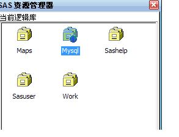
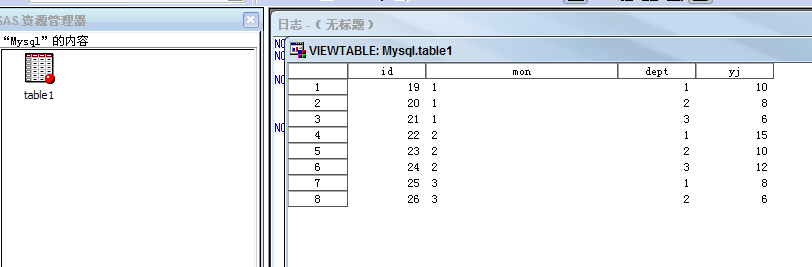
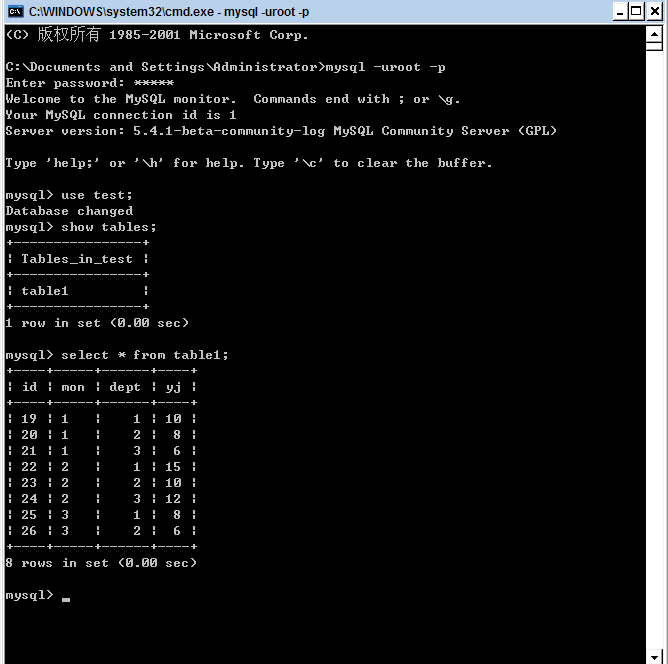
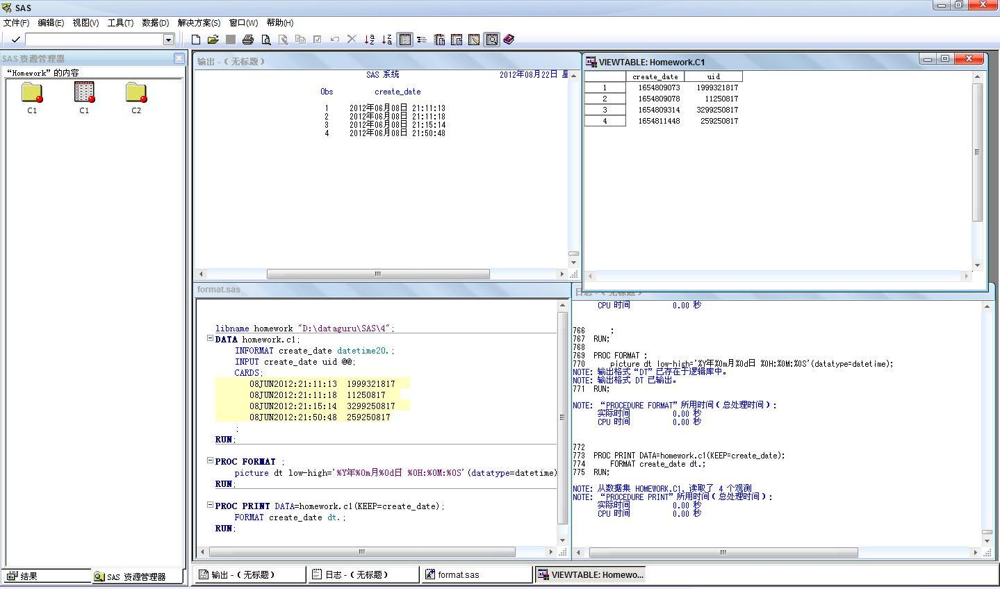

数据分析与SAS 第四周作业 - 张丹(11)
========================================================

阅读作业 
1 阅读朱世武的书，学习关于SQL过程的详细用法 
阅读作业由大家自行掌握，不纳入罚扣考核范围 

书面作业 
1 尝试在两种不同的数据库（例如在本地的mysql和oracle）之间通过SAS传递数据，数据库的品种任选，数据集自行构建。将实验过程抓图。 
2 读入一些日期值（自行构建数据源），要求以中文日期格式输出（例如”2012年8月21日“），给出源代码，欢迎多种方法尝试 

互动作业 
本周的互动继续以SAS编程讨论为主。可以围绕第4周课程有关知识展开。 
要求每位同学至少发2篇主题（SAS中国用户组板块），至少参与5个上述主题的讨论（回帖）。 
注意在Dataguru课程平台上，新增加“互动”功能标签，大家进入后可以看到本周的互动要求（板块，时间段，数量等），以及你现在的完成进度情况。 
本周的书面作业和互动作业都纳入罚扣考核范围，请大家注意按时按质完成！


1. 分别连接MySQL, SPSS, EXCEL如图所示
----------------------------------------------------

连接MySQL示例：








连接SPSS示例：


连接EXCEL示例：


2. 转换日期格式，FORMAT过程picture关键字
----------------------------------------------------

```{sas}
libname homework "D:\dataguru\SAS\4";
DATA homework.c1;
  INFORMAT create_date datetime20.;
	INPUT create_date uid @@;
	CARDS;
	   08JUN2012:21:11:13  1999321817   
	   08JUN2012:21:11:18  11250817   
	   08JUN2012:21:15:14  3299250817   
	   08JUN2012:21:50:48  259250817
	;
RUN;

PROC FORMAT ;
	picture dt low-high='%Y年%0m月%0d日 %0H:%0M:%0S'(datatype=datetime);
RUN;

PROC PRINT DATA=homework.c1(KEEP=create_date);
	FORMAT create_date dt.;
RUN;

```


