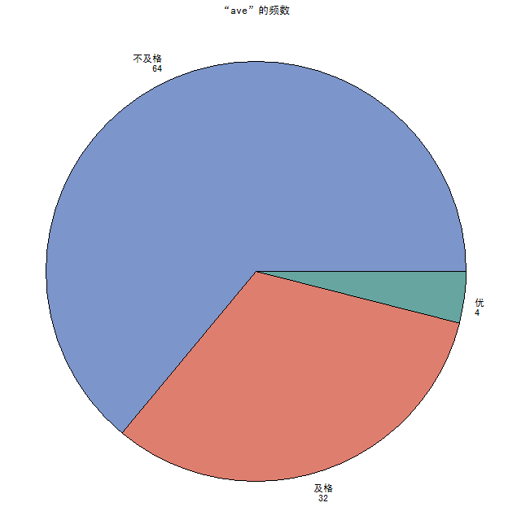

数据分析与SAS 第五周作业 - 张丹(11)
========================================================

阅读作业 
继续阅读薛毅的书或其它关于概率统计的教材，下周将讲假设检验，需要一些基本的概率统计概念 

书面作业 
设有100名学生（学号1-100），其中1-50为甲班，51-100为乙班，随机产生他们语文，数学，英语三科成绩，凡是>=85定为“优”，<60为“不及格”，其余为“及格” 
1 利用FREQ过程计算平均成绩各等级的频数 
2 利用TABULATE过程按班和科目，给出各科成绩等级的人数和百分比，画出适当的表格 
3 对平均分的各等级画出饼图 

互动作业 
本周的互动继续以SAS编程讨论为主。可以围绕第6周课程有关知识展开。 
要求每位同学至少发2篇主题（SAS中国用户组板块），至少参与5个上述主题的讨论（回帖）。 
注意在Dataguru课程平台上，新增加“互动”功能标签，大家进入后可以看到本周的互动要求（板块，时间段，数量等），以及你现在的完成进度情况。 
本周的书面作业和互动作业都纳入罚扣考核范围，请大家注意按时按质完成！

### 1. 创建数据集，并存储在homework库中

      LIBNAME homework "D:\dataguru\SAS\6";
      DATA homework.ch1;
         RETAIN _seed_ 0;
      	RETAIN _size_ 100;
      	DO _i_ =1 TO _size_;
      		IF _i_ LE _size_/2 THEN glass='甲班' ;
      		ELSE glass='乙班';
      		x1 = round(ranuni(_seed_)*100);
      		x2 = round(ranuni(_seed_)*100);
      		x3 = round(ranuni(_seed_)*100);
      		ave = round(MEAN(OF x1-x3));
      		OUTPUT;
          END;
      	DROP _seed_ _size_;
       RUN;
       PROC PRINT;
       RUN;

       Simple Vertical Bar Chart    2012年09月05日 星期三 下午02时22分04秒 346
      
         Obs    _i_    glass    x1    x2     x3    ave

        79     79    乙班     34    49     56     46
        80     80    乙班     32    78     69     60
        81     81    乙班     95    77     92     88
        82     82    乙班     61    27     26     38
        83     83    乙班      9    48     60     39
        84     84    乙班     44    44     71     53
        85     85    乙班     10     5     63     26
        86     86    乙班     64    25     51     47
        87     87    乙班     79    27     89     65
        88     88    乙班     67    26     21     38
        89     89    乙班     96    27     80     68
        90     90    乙班     98    84     43     75
        91     91    乙班      4    24     30     19
        92     92    乙班     14    16     69     33
        93     93    乙班     33    34    100     56
        94     94    乙班     86    13     23     41
        95     95    乙班     83    25     74     61
        96     96    乙班     27    48     33     36
        97     97    乙班     32    12     16     20
        98     98    乙班     37    69     56     54
        99     99    乙班     17    88    100     68
        100    100    乙班      4    22     84     37

***

        PROC FORMAT;
        VALUE vfmt LOW-<60='不及格'
          	   60-<85='及格'
        		   85-HIGH='优';
        PROC FREQ DATA=homework.ch1;
        	FORMAT ave vfmt.;
        	TABLEs ave;
        RUN;

        Simple Vertical Bar Chart     2012年09月05日 星期三 下午02时22分04秒 329

        FREQ PROCEDURE
        
          ave      频数      百分比     累积频数    累积百分比
        -------------------------------------------------------
        不及格          64     64.00           64       64.00
        及格            32     32.00           96       96.00
        优               4      4.00          100      100.00

### 2. 生成表格

        PROC FORMAT;
        VALUE vfmt LOW-<60='不及格'
          	   60-<85='及格'
        		   85-HIGH='优';
        DATA homework.ch2;
        	set homework.ch1;
        	FORMAT x1 x2 x3 vfmt.;
        	DROP ave;
        RUN;
        PROC TABULATE;
        	CLASS  glass x1 x2 x3;
        	TABLE glass * (N*F=6.0 PCTN<x1 x2 x3>*F=6.2),x1 x2 x3 ;
        	LABEL glass='班级' x1='语文' x2='数学' x3='英语';
        	KEYLABEL N='人数' PCTN='百分比';
        RUN;
        
         Vertical Bar Chart                2012年09月05日 星期三 下午02时22分04秒 370
         -------------------------------------------------------------------------------------------------
         |                                |        语文        |        数学        |        英语        |
         |                                |--------------------+--------------------+--------------------|
         |                                |不及格| 及格 |  优  |不及格| 及格 |  优  |不及格| 及格 |  优  |
         |--------------------------------+------+------+------+------+------+------+------+------+------|
         |班级           |                |      |      |      |      |      |      |      |      |      |
         |---------------+----------------|      |      |      |      |      |      |      |      |      |
         |甲班           |人数            |    28|    11|    11|    31|    11|     8|    26|    14|    10|
         |               |----------------+------+------+------+------+------+------+------+------+------|
         |               |百分比          | 56.00| 22.00| 22.00| 62.00| 22.00| 16.00| 52.00| 28.00| 20.00|
         |---------------+----------------+------+------+------+------+------+------+------+------+------|
         |乙班           |人数            |    28|    13|     9|    33|     9|     8|    22|    18|    10|
         |               |----------------+------+------+------+------+------+------+------+------+------|
         |               |百分比          | 56.00| 26.00| 18.00| 66.00| 18.00| 16.00| 44.00| 36.00| 20.00|
         -------------------------------------------------------------------------------------------------

### 3. 生成饼图

        PROC FORMAT;
        VALUE vfmt LOW-<60='不及格'
          	   60-<85='及格'
        		   85-HIGH='优';
        DATA homework.ch3;
        	set homework.ch1;
        	FORMAT ave vfmt.;
        	DROP x1 x2 x3 glass;
        RUN;
        PROC PRINT DATA=homework.ch3;
        RUN;
        OPTION PS=30;
        PROC CHART DATA=homework.ch3;
        	PIE ave / DISCRETE;
        RUN;

    Simple Vertical Bar Chart   2012年09月05日 星期三 下午02时22分04秒 375

                    ave 的频数
        
            不及格   *********
                 ****         ****
               **                 **
              *                     *
            **       64              **
           **      64.00%             **
           *                           *
          *                             *
          *                             *
          *              +  . . .. 4 .. *
          *                   .. 4.00%  *  优
          *           ..            . . *
           *         .                 *
           **       .     32          **
            **    ..    32.00%       **
              *  .                  *
               **                 **
                 ****         ****
                     *********
                            及格

