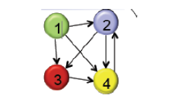
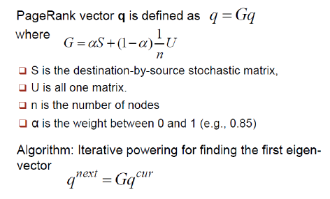

用R模拟PageRank算法
========================================================

### 假设1,2,3,4，4个网页，链接引用关系为如下图


### 转换为矩阵如下：

         [,1] [,2] [,3] [,4]
    [1,]    0    0    0    0
    [2,]    1    0    0    1
    [3,]    1    1    0    0
    [4,]    1    1    1    0

### 根据Page Rank计算公式


```{r}
pagerank<-function(G,method='eigen',d=.85,niter=100){
  cvec <- apply(G,2,sum)
  cvec[cvec==0] <- 1
  gvec <- apply(G,1,sum)
  n <- nrow(G)
  delta <- (1-d)/n
  A <- matrix(delta,nrow(G),ncol(G))
  for (i in 1:n) 
    A[i,] <- A[i,] + d*G[i,]/cvec

  if (method=='power'){ # 循环计算
    x <- rep(1,n)
    for (i in 1:niter) x <- A%*%x
    
  } else { # 直接求特征值
    x <- Re(eigen(A)$vector[,1])
  }
  x/sum(x)
}


n<-4
S0<-t(matrix(c(0,0,0,0,1,0,0,1,1,1,0,0,1,1,1,0),nrow=n));S0
```

### Page Rank打分结果
```{r}
pagerank(S0)
```
