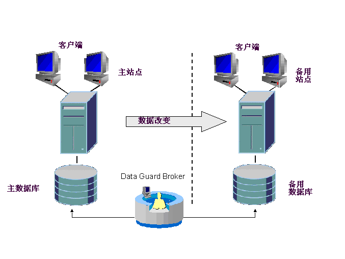
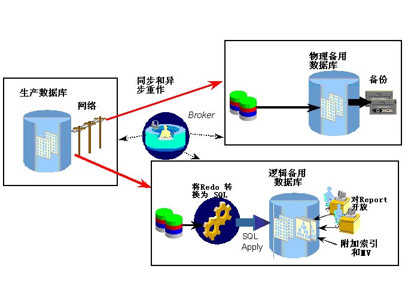
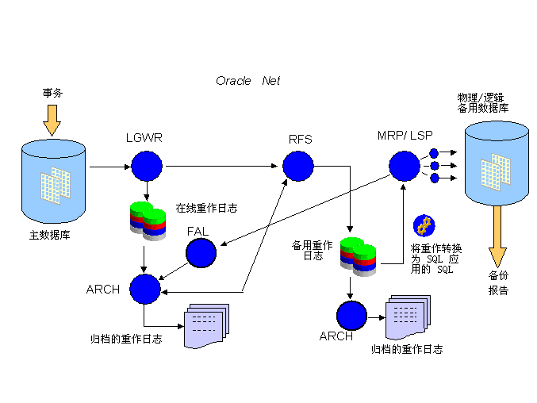

Oracle 第十一周作业 - 张丹(15)
========================================================

阅读作业 《让Oracle跑得更快1》第8.7章 直接加载。

以下题目都需要数据库的实际操作输出，而不是单纯语言论述：
1.假如有一个分布式数据库系统，包含10台数据库，每台数据库上存放有10T的数据，数据通过sql*loader定时批量加载到分布式环境中的每台数据中，在允许增加硬件的前提下，设计一套数据备份和恢复方案，让系统down机的时间尽可能的短，画出数据备份和恢复的流程图，并加上文字描述

2.创建只读表空间，比较只读表空间文件头的checkpoint是否随数据库的checkpoint的变化而变化。

3.在只读表空间上演示创建表，insert，delete,truncate,drop等操作

4.对于1台10T的数据库，设计一个你自己认为可行的远程容灾系统（接近实时），给出流程图和描述语言（假设网络带宽足够）。

互动作业 

请所有的学员都在炼数成金网站（http://f.dataguru.cn）注册账号，并且在“真实姓名”属性项填写“ora-nn”的字样（此处nn代表分配 的学号），使我们可以在公众用户中识别出学员。 要求大家在本周参与“相关IT支撑技术”板块（讨论数据库相关技术）,"关系型数据库数 据分析"(OLAP相关技术的讨论)的互动。每位学员至少以主题帖的形式提出2个问题（或讨论话题）然后至少参加5个上述主题的讨论（回帖形 式）。

***

## 1. 分布式数据库，海量数据，而且让系统down机的时间尽可能的短。因为，需要设计尽可能高效的恢复方案。

### 1. 数据拆分：
  1) 10T数据量对于一台DB来说，数据过大。采用分步式的架构，将10T数据分散到10台数据库上。
  2) 创建大小为1G的表空间，把数据表和索引分为放到单独的表空间中，从而控制每个部分数据的大小。
  3) 每次sql*loader数据导入完成后，把数据表空间设置为只读表空间。  

### 2. 数据备份：存储sql*loader加载的原始数据，作为数据备份的数据。

### 3. 数据恢复：哪个节点的哪个表空间出了问题，找到出问题的节点和空间，重新执行sql*loader。

#### 对于数据备份和恢复的优化：
1) 在系统不忙的时候，把已导入的数据，通过交换表空间导出备份，替代之间原始数据存储。
2) 然后，再进行的恢复的时候，通过交换表空间进行恢复。

***

## 2. 创建两个表空间，一个readonly, 一个readwrite

SQL> alter system set db_create_file_dest='E:\tookit\oracle\11.2.0\userspace';

系统已更改。

SQL> create tablespace readonly datafile size 10M;

表空间已创建。

SQL> create tablespace readwrite datafile size 10M;

表空间已创建。

SQL> select name,file#,checkpoint_change# from v$datafile where name like '%READ%';

    NAME                                                                                 FILE#   CHECKPOINT_CHANGE#
    -------------------------------------------------------------------------------- --------- --------------------
    E:\TOOKIT\ORACLE\11.2.0\USERSPACE\ORCL\DATAFILE\O1_MF_READONLY_84V74L5C_.DBF             6            1425007
    E:\TOOKIT\ORACLE\11.2.0\USERSPACE\ORCL\DATAFILE\O1_MF_READWRIT_84V74Q4W_.DBF             7            1425280

SQL> alter tablespace readonly read only;

表空间已更改。

SQL> select name,file#,checkpoint_change# from v$datafile where name like '%READ%';

    NAME                                                                                 FILE#   CHECKPOINT_CHANGE#
    -------------------------------------------------------------------------------- --------- --------------------
    E:\TOOKIT\ORACLE\11.2.0\USERSPACE\ORCL\DATAFILE\O1_MF_READONLY_84V74L5C_.DBF             6            1425562
    E:\TOOKIT\ORACLE\11.2.0\USERSPACE\ORCL\DATAFILE\O1_MF_READWRIT_84V74Q4W_.DBF             7            1425280

### 修改readonly表空间表read only时，系统写入6发生变化

SQL> alter system checkpoint;

系统已更改。

SQL> select name,file#,checkpoint_change# from v$datafile where name like '%READ%';

    NAME                                                                                 FILE#   CHECKPOINT_CHANGE#
    -------------------------------------------------------------------------------- --------- --------------------
    E:\TOOKIT\ORACLE\11.2.0\USERSPACE\ORCL\DATAFILE\O1_MF_READONLY_84V74L5C_.DBF             6            1425562   
    E:\TOOKIT\ORACLE\11.2.0\USERSPACE\ORCL\DATAFILE\O1_MF_READWRIT_84V74Q4W_.DBF             7            1425574

### 执行checkpoint命令时，6没有变化，7发生变化

***

## 3. 继续用第二题中的readonly表空间，首先修改空间为读写。

SQL> alter tablespace readonly read write;

表空间已更改。

SQL> create table t11_readonly tablespace readonly
  2  as select object_id as id , object_name as name from dba_objects where rownum<10000;

表已创建。

SQL> select * from t11_readonly where rownum<10;

            ID  NAME
    ---------- -------
            20 ICOL$
            46 I_USER1
            28 CON$
            15 UNDO$
            29 C_COBJ#
             3 I_OBJ#
            25 PROXY_ROLE_DATA$
            41 I_IND1
            54 I_CDEF2
    
    已选择9行。

SQL> alter tablespace readonly read only;

表空间已更改。

SQL> insert into t11_readonly values(999000,'121');

    insert into t11_readonly values(999000,'121')
                *
    第 1 行出现错误:
    ORA-00372: 此时无法修改文件 6
    ORA-01110: 数据文件 6:
    'E:\TOOKIT\ORACLE\11.2.0\USERSPACE\ORCL\DATAFILE\O1_MF_READONLY_84V74L5C_.DBF'

SQL> delete from t11_readonly  where rownum<10;

    delete from t11_readonly  where rownum<10
                *
    第 1 行出现错误:
    ORA-00372: 此时无法修改文件 6
    ORA-01110: 数据文件 6:
    'E:\TOOKIT\ORACLE\11.2.0\USERSPACE\ORCL\DATAFILE\O1_MF_READONLY_84V74L5C_.DBF'
    
### delete失效

SQL> truncate table t11_readonly;

      truncate table t11_readonly
                     *
      第 1 行出现错误:
      ORA-00372: 此时无法修改文件 6
      ORA-01110: 数据文件 6:
      'E:\TOOKIT\ORACLE\11.2.0\USERSPACE\ORCL\DATAFILE\O1_MF_READONLY_84V74L5C_.DBF'

### truncate失效

SQL> drop table t11_readonly;

表已删除。

### drop成功

SQL> select * from t11_readonly where rownum<10;
select * from t11_readonly where rownum<10
              *
第 1 行出现错误:
ORA-00942: 表或视图不存在

### 表被删除成功

***

## 4.对于1台10T的数据库，可以使用Oracle Data Guard的远程容灾方案。
### 采用最高性能模式+物理Standby。

Data Guard 利用重做数据保持这种事务一致性。当主数据库中发生事务时，则生成重做数据并将其写入本地重做日志文件中。
通过 Data Guard，还将重做数据传输到备用站点上，并应用到备用数据库中，从而使备用数据库与主数据库保持同步。
Data Guard 允许管理员选择将重做数据同步还是异步地发送到备用站点上。

### ORACLE DATA GUARD 进程结构

数据保护模式

    保护模式    在出现灾难时数据丢失的风险    重做传输机制
    --------- -----------------------------  ------------
    最大保护    零数据丢失;双重故障保护       LGWR SYNC
    最高可用性  零数据丢失;单故障保护         LGWR SYNC
    最高性能    最小数据丢失;通常从0到几秒    LGWR ASYNC 或 ARCH

#### 由于10T数据，数据量过大，因为使用“最大保护”的模式，从性能的角度上会给系统造成非常大的负担，因为我认为“最高性能”是最好的模式。

